# Projeto de Automação de Testes WEB - Agibank

Este projeto de automação de testes foi desenvolvido para validar o componente de pesquisa de artigos do blog do agi. Utiliza Robotframework com Python e SeleniumWebdriver.

# Estrutura do projeto

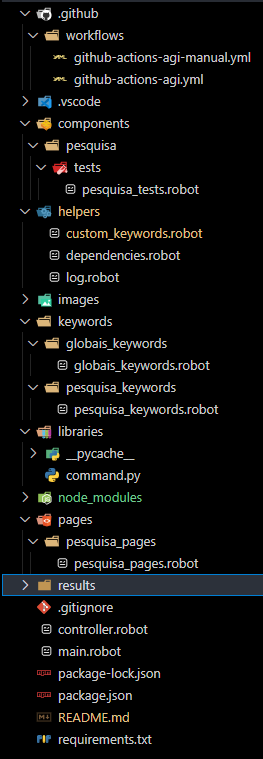

### .github/workflows

- Contém os arquivos de execução para pipeline do GitHub.

### components

- Contém os arquivos de test's, por componentes, a serem executados.

### helpers

- Contém os arquivos de configuração e keywords personalizadas.

### keywords

- Keywords referente aos componentes.

### libraries

- Bibliotecas personalizadas em Python.

### pages

- Page Objects referente aos componentes.

### results

- Resultado dos testes automatizados.

# Configuração do Ambiente

### Instalando o Java mais recente

1. Baixe o JDK para sua plataforma em [Oracle JDK](https://www.oracle.com/java/technologies/javase-jdk11-downloads.html) ou uma versão OpenJDK de sua escolha.
2. Instale o JDK seguindo as instruções específicas para o seu sistema operacional.
3. Configure a variável de ambiente `JAVA_HOME` para apontar para o diretório onde o JDK foi instalado.
4. Adicione o caminho do executável do JDK ao `PATH` do sistema.

### Instalação Python

Para instalação correta das bibliotecas, o _Python_ deve ser previamente instalado. Acesse [www.python.org/downloads](https://www.python.org/downloads/) e siga as instruções abaixo:

1. Clique na opção `Download Python 3.10.5` ou na versão mais atual disponível no momento do acesso à página.

2. Selecione a opção `Add Python 3.10 to PATH` e clique em `Install Now`.

3. Aguarde a instalação.

4. Instalação concluída, clique em `Close`.

### Instalação Robot Libraries Installer

Este programa tem por objetivo auxiliar na instalação das bibliotecas necessárias para a correta utilização do _Robot Framework_ com _Visual Studio Code_.

Baixe o arquivo [RobotLibrariesInstaller.bat](https://drive.google.com/file/d/1hDVbP7QXGrfOSxW8JUXmyRBSTf6HWnn7/view?usp=sharing) e siga as instruções abaixo:

1. Acesse o link acima e clique na opção `Fazer o download`.

2. Salve o arquivo em sua área de trabalho.

3. Clique com o botão direito do mouse no ícone do arquivo em questão e selecione `Executar como administrador`.

4. Digite `1` e clique em `Enter` no seu teclado.

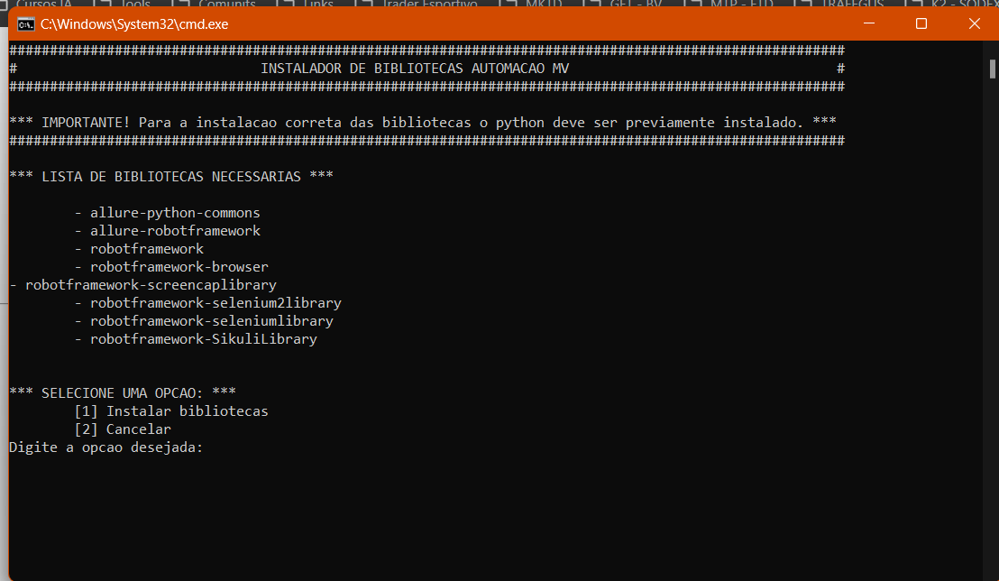

5. Aguarde a instalação. Após, pressione qualquer tecla para sair do instalador.

### Instalação Visual Studio Code

1. Baixe o Visual Studio Code em [VSCode](https://code.visualstudio.com/download).

### Instalação Extensões Visual Studio Code

Abra seu VSCode e instale as seguintes extensões:

1. Pylance.

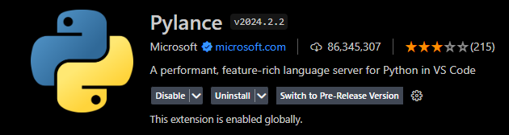

2. Python.

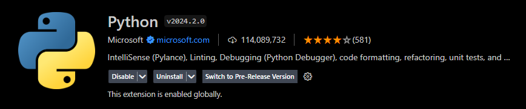

3. Python Debugger.

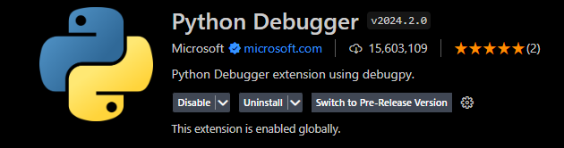

4. Robot Framework Language Server.

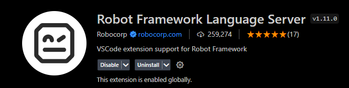

# Clonando o projeto

1. Clone o repositório do [projeto](https://github.com/hyggedigitaltecnologia/web_tests_agibank.git).

2. Abra o projeto em seu VSCode.

3. Abra um terminal na raiz do projeto e faça os seguintes downloads. 

### Instalando o Node

1. Baixe o NodeJs em [Node](https://nodejs.org/en/download).

### Instalando o Allure

1. Baixe o Allure executando:

```bash
npm install --save-dev allure-commandline

npx allure-commandline serve
```

2. Feche e abra seu terminal.

# Como executar

1. Abra um terminal na raiz do projeto.

2. Digite o comando:

```bash
1. Executar todos os testes:

robot --variable COMPONENTE:pesquisa/tests/pesquisa_tests.robot --variable TAG:test --variable BROWSER:chrome controller.robot

2. Executar somente um teste:

robot --variable COMPONENTE:pesquisa/tests/pesquisa_tests.robot --variable TAG:pesquisa_valida --variable BROWSER:chrome controller.robot

robot --variable COMPONENTE:pesquisa/tests/pesquisa_tests.robot --variable TAG:pesquisa_invalida --variable BROWSER:chrome controller.robot
```

# Gerando Relatório Allure

1. Execute os seguintes comandos:

```bash
1. allure generate --clean ./output/allure -o allure-report/

2. allure open
```
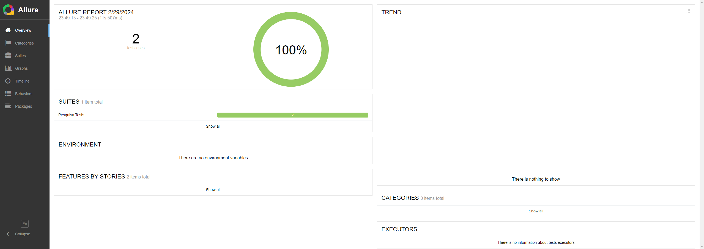

# Executando no GitHub Actions

Acesse as [actions](https://github.com/hyggedigitaltecnologia/web_tests_agibank/actions) e siga os passos:

1. Clique em "Manual Run WEB Tests".

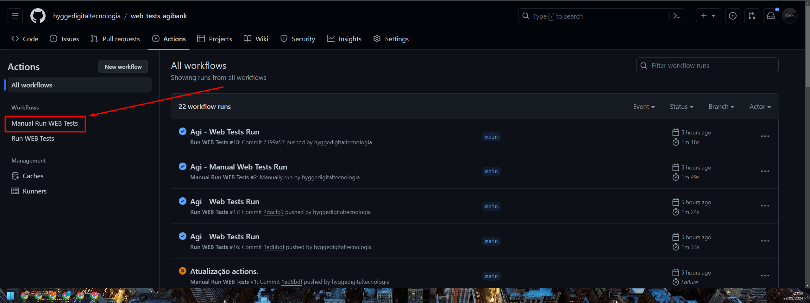

2. Clique em "Run workflow".

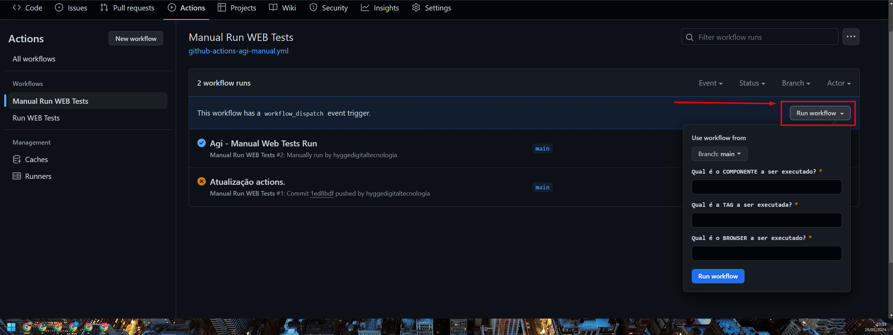

3. Preencha os campos de tal forma que:

```bash
Qual é o COMPONENTE a ser executado?

-> pesquisa/tests/pesquisa_tests.robot

Qual é a TAG a ser executada?

-> test

Qual é o BROWSER a ser executado?

-> chrome
```

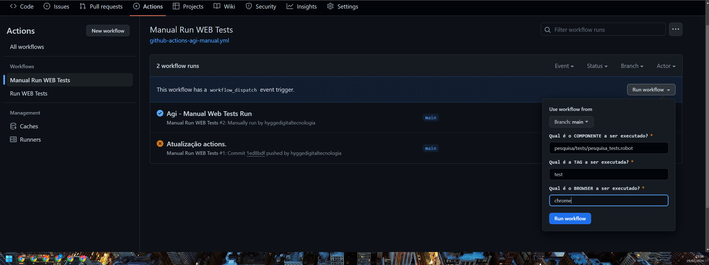

4. Clique em "Run worflow".

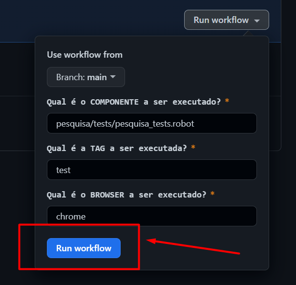

5. Aguarde a execução.

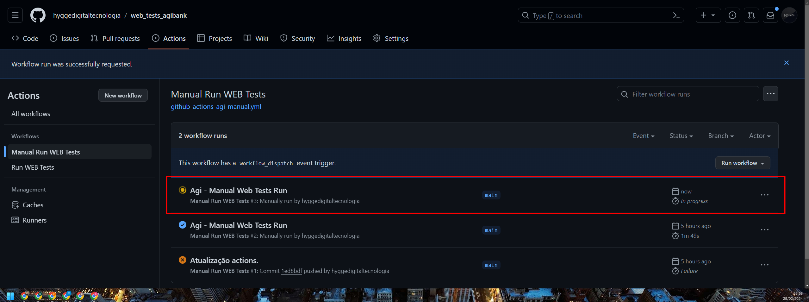

6. Acesse o run.

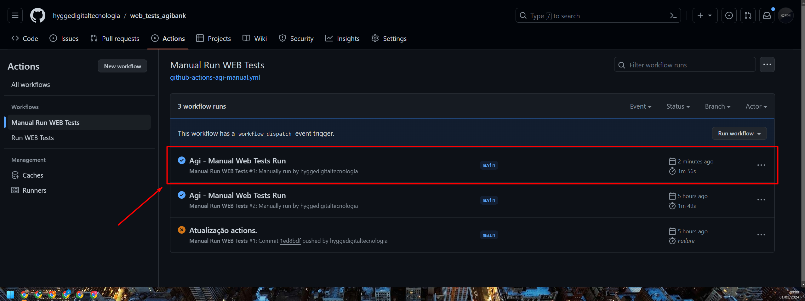

7. Tenha acesso ao relatório para download e os dados de execução.

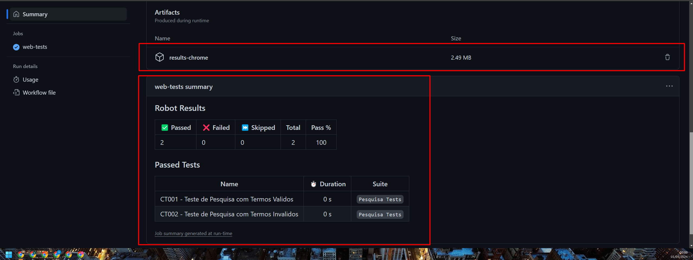

# Execução do Projeto

[](https://youtu.be/zyeVnE7Nv4M)